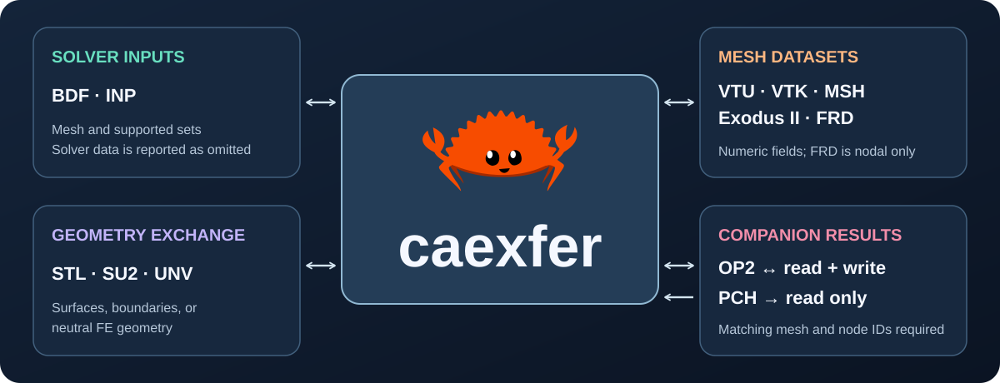

[](https://github.com/cmccomb/caexfer/actions/workflows/ci.yml)

# caexfer

<p align="center"></p>

**Engineering files, without silent data loss.**

caexfer separates the original engineering document from the information a
particular downstream tool can represent. Read and preserve the document first;
project it into geometry only when that loss of information is explicit.

[](assets/conversion-flow.svg)

The illustration shows the difference between preserving a BDF, editing one
GRID node's coordinates, and projecting geometry into VTU. The VTU keeps
original IDs but omits nongeometry records and reports those omissions.

## From/to matrix

| From ↓ / To → | BDF | VTU | MSH 4.1 | INP | FRD | OP2 |
| --- | --- | --- | --- | --- | --- | --- |
| **BDF** | C / M | M | M | M | — | — |
| **VTU** | M | C / F | F | M | — | — |
| **MSH 4.1** | M | F | C / F | M | — | — |
| **INP** | M | M | M | C / M | — | — |
| **FRD** | M | F | F | M | C | — |
| **OP2 + BDF mesh** | M* | F* | F* | M* | — | C |

**C** is `roundtrip`, a byte-identical source copy. BDF additionally supports
`set-grid`. **M** is a linear mesh projection with original node and element IDs.
**F** carries the mesh plus supported numeric point/cell fields. `*` requires
`--mesh model.bdf`; OP2 currently extracts one real six-component displacement
table through pyNastran. An em dash means there is no writer for that format.
Every `convert` route requires `--geometry-only` and reports omissions. This
flag acknowledges projection into the supported mesh/field subset; it does not
mean numeric fields are discarded on **F** routes.

BDF and INP outputs from `convert` are **geometry-only decks**, not runnable
solver models. FRD and OP2 may be copied verbatim but cannot be generated.
MSH/VTU preserve supported numeric values; MSH has no component-label slot,
and BDF property IDs have no mapping in this MSH/INP exporter. Those losses are
reported. See [the precise format limits](docs/SUPPORT.md).

This is the **0.1.0 source repository**, not a crates.io publication. The
[build status](docs/BUILD-STATUS.md) records local verification. The version
number is not a production-readiness claim.

## Start here

Requires Rust/Cargo 1.85 or newer. No third-party Rust crates or native libraries
are required by this workspace. From this directory:

```sh
cargo test --workspace --all-features --locked --offline
cargo install --path crates/caexfer --locked --offline

caexfer formats
caexfer info examples/plate.bdf
caexfer validate examples/plate.bdf
caexfer roundtrip examples/plate.bdf plate-copy.bdf
caexfer set-grid examples/plate.bdf edited.bdf --id 20 --xyz 1.2 0 0
caexfer convert examples/plate.bdf plate.vtu --geometry-only
caexfer convert examples/plate.bdf plate.msh --geometry-only
caexfer convert tests/fixtures/linear-results.frd results.vtu --geometry-only
# OP2 example, with pyNastran in a Python 3.12 environment:
caexfer convert model.op2 displacement.vtu --mesh model.bdf --python /path/to/python3.12 --geometry-only
```

Output paths must be new. `plate-copy.bdf` preserves the original file bytes.
`edited.bdf` changes only the three requested GRID coordinate fields.
`plate.vtu` contains geometry and original IDs, **not a runnable Nastran model**.
The converter reports what it excludes. No command overwrites the source.

`cargo install caexfer` is **not** the installation instruction for this repository:
the package has not been published to a registry.

## What 0.1 does

The BDF reader indexes small-field, large-field, and comma-separated data, with
adjacent continuations. It retains original source bytes, including comments,
unknown cards, line endings, and control-section text. Semantic access covers
GRID records and a documented subset of linear element connectivity.

The native BDF writer is a **document-preserving writer**. A separate
geometry-only BDF exporter produces mesh cards, not a solver model. Coordinate edits patch existing fields transactionally. A value that
cannot fit a fixed-width field without rounding is rejected rather than
silently shortened.

The VTU writer produces ASCII VTK XML UnstructuredGrid mesh and numeric fields with UInt64
`nastran_node_id`, `nastran_element_id`, and `nastran_property_id` arrays.
Absent property IDs, for CONROD, use the reserved value zero. Coordinates are
Float64. Original IDs are not confused with zero-based connectivity indices.

Supported geometry: CROD, CONROD, CBAR, CBEAM, CTRIA3, CQUAD4, linear CTETRA,
CHEXA, CPENTA, and CPYRAM. Bars/beams become their node-to-node centerline only;
section data, orientations, and offsets are not projected. Higher-order solids
are rejected, not reduced to their corner nodes.

**Not implemented:** FRD/OP2 generation, binary/compressed VTU or MSH,
INCLUDE expansion, coordinate-system resolution, GRDSET defaults, solver-ready
BDF/INP generation, mesh repair, unit conversion, Python bindings, or lazy
multi-gigabyte result access. OP2 decoding requires an external pyNastran
installation. Unsupported geometry is rejected rather than silently skipped.

The exact boundary is in [SUPPORT.md](docs/SUPPORT.md).

## Command-line use

```sh
caexfer info examples/plate.bdf --json
caexfer validate examples/plate.bdf --strict --json
caexfer info known-bdf-without-extension --from bdf
caexfer info larger.bdf --max-bytes 536870912
```

JSON output carries `schema_version: 1`. `validate` means **geometry-subset
validation**, not complete solver validity. Materials, properties, loads,
constraints, and control sections are not solver-validated. Recognized opaque
nongeometry card types produce warnings; `--strict` turns those warnings into a
failed command. See [CLI.md](docs/CLI.md) for exit codes and error behavior.

## Rust library use

For a local consuming project, use a path dependency to this repository:

```toml
[dependencies]
caexfer-formats = { path = "../caexfer/crates/caexfer-formats", features = ["bdf", "vtu"] }
```

```rust
use caexfer_formats::{bdf::Document, vtu};

fn main() -> Result<(), Box<dyn std::error::Error>> {
    let document = Document::open("model.bdf")?;

    // Native representation: nothing is discarded.
    for card in document.cards() {
        println!("{} at physical line {}", card.name(), card.line);
    }

    // Explicitly lossy projection, with a report of omissions.
    let projection = document.geometry()?;
    for omission in &projection.omissions {
        eprintln!("{}: {}", omission.category, omission.detail);
    }
    let file = std::fs::OpenOptions::new()
        .write(true).create_new(true).open("model.vtu")?;
    let mut buffered = std::io::BufWriter::new(file);
    vtu::write(&projection.mesh, &mut buffered)?;
    std::io::Write::flush(&mut buffered)?;
    Ok(())
}
```

A caller writing to its own stream owns output durability/error handling. The
CLI additionally stages its file output before installing a new destination.

For only BDF, depend directly on `crates/caexfer-bdf`. The umbrella crate defaults
to **no format features**. It conditionally exposes the BDF and VTU crates plus the MSH, INP, FRD,
and OP2 adapters. The OP2 adapter calls pyNastran only when used.

The public BDF interface centers on `Document`, its card and GRID views,
geometry projection, scoped diagnostics, and coordinate edits. Inspect a card's
data through `Document::card_text`; source span indexing and physical field
format classification are implementation details.

## Workspace

| Package | Responsibility |
| --- | --- |
| `caexfer` | CLI, JSON reporting, staged no-clobber output |
| `caexfer-bdf` | Native BDF document, field indexing, edits, geometry projection |
| `caexfer-vtu` | ASCII VTU mesh and field reader/writer |
| `caexfer-formats` | Feature-selected BDF, VTU, MSH, INP, FRD, OP2 adapters |
| `caexfer-core` | Diagnostics, linear mesh and located numeric field types |

No universal solver IR, runtime plugin registry, AI interface, or empty format
crate is included. Those are not prerequisites for reading a file correctly.

## Verification

```sh
cargo test --workspace --all-features --locked --offline
cargo check -p caexfer-formats --no-default-features --locked --offline
cargo check -p caexfer-formats --no-default-features --features bdf --locked --offline
cargo check -p caexfer-formats --no-default-features --features vtu --locked --offline
for feature in msh inp frd op2; do cargo check -p caexfer-formats --no-default-features --features "$feature" --locked --offline; done
cargo fmt --all -- --check
cargo clippy --workspace --all-targets --all-features --locked --offline -- -D warnings
RUSTDOCFLAGS='-D warnings' cargo doc --workspace --all-features --no-deps --locked --offline
python3 scripts/check_source.py
python3 scripts/check_interop.py --build
python3 scripts/check_matrix.py
python3 scripts/generate_readme_diagram.py --check
```

The interoperability scripts execute every advertised conversion route, check
JSON and XML, verify native copies, and check linear cell families against an
explicit fixture. Run `python3 scripts/check_matrix.py --op2-python PATH` with
a Python 3.11/3.12 interpreter containing pyNastran to check the OP2 routes
against the included real result fixture. With Python VTK installed, add `--vtk` for
an independent VTK reader check. The Python scripts require Python 3.11+.

CI covers Linux, macOS, Windows, and the intended minimum Rust version. The
[verification record](docs/BUILD-STATUS.md) lists checks that have run and the
remaining limits of this source candidate.

## Development and release

Read [DESIGN.md](docs/DESIGN.md) before changing preservation or projection
semantics. [ROADMAP.md](docs/ROADMAP.md) describes the next format milestones.
[RELEASING.md](docs/RELEASING.md) lists the gates before a registry publication.
Regenerate the diagram with `python3 scripts/generate_readme_diagram.py` after
changing the supported outputs.

Licensed under MIT OR Apache-2.0. The imported pyNastran OP2/BDF fixtures
retain their upstream BSD license; see `tests/fixtures/PROVENANCE.md`.
